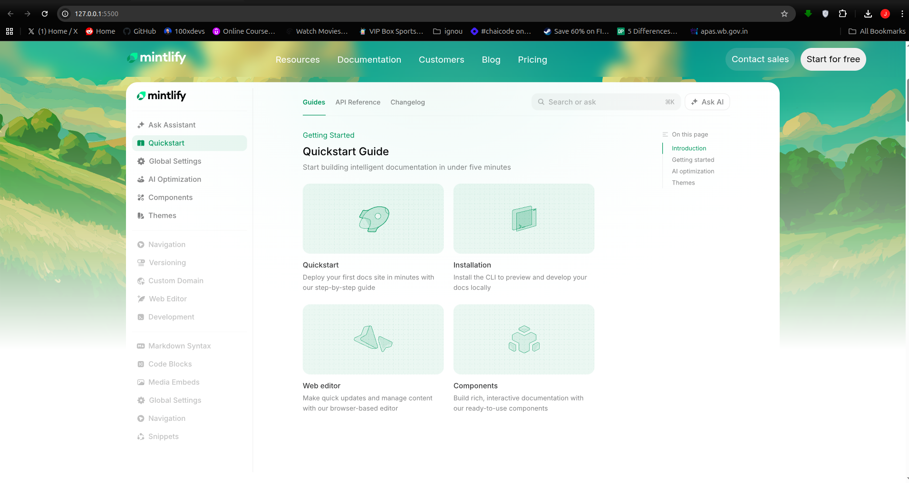
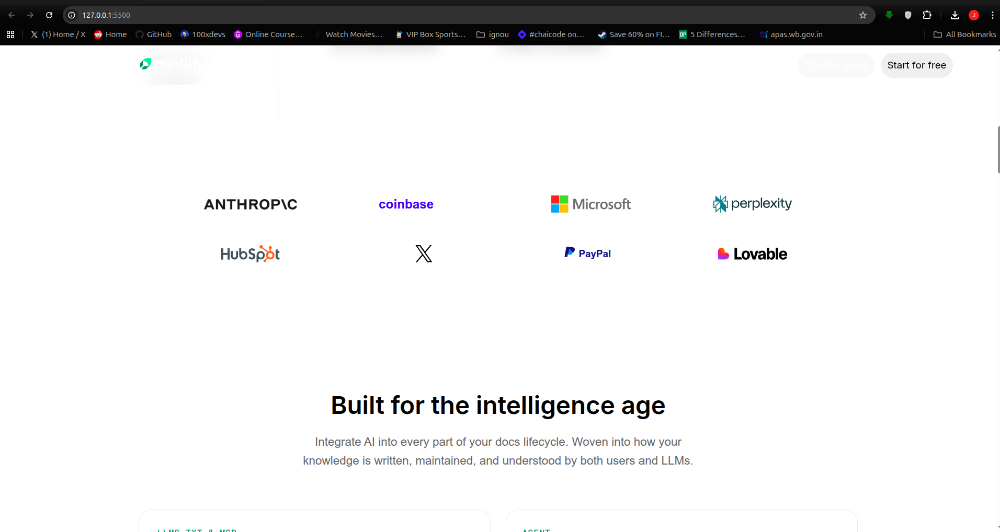
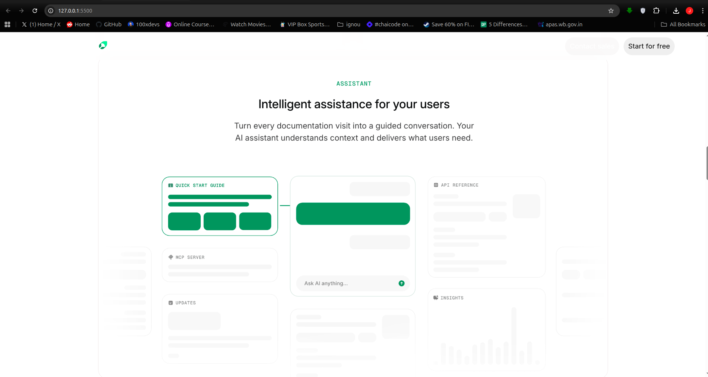
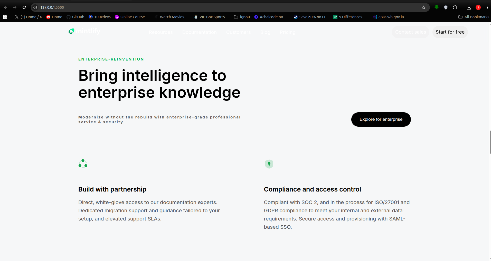
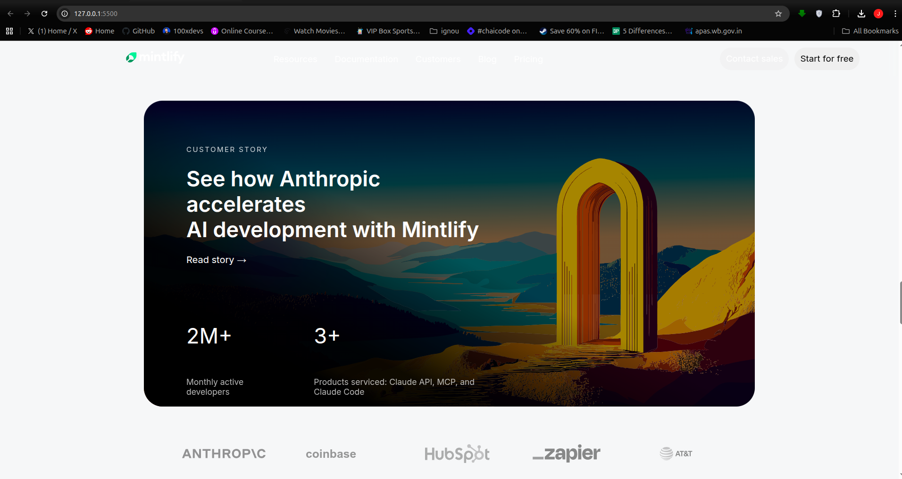
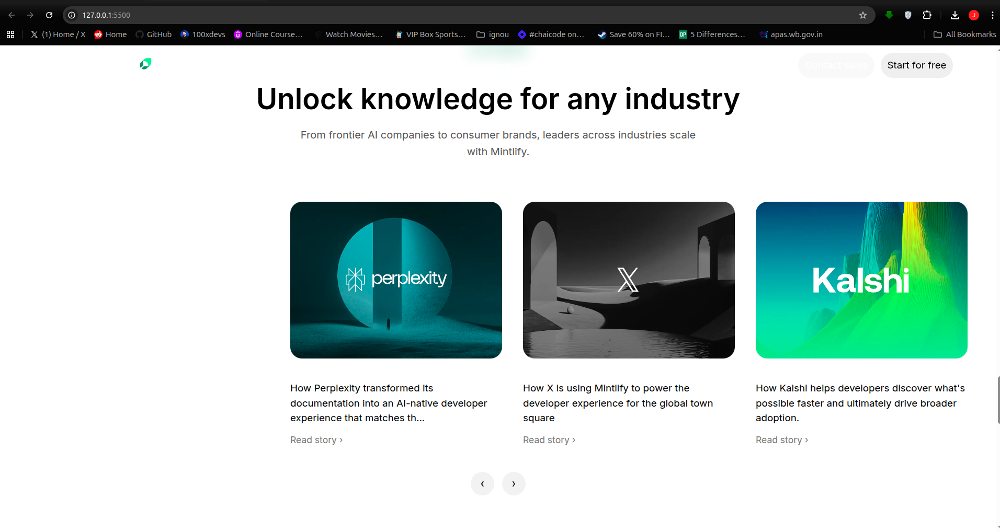
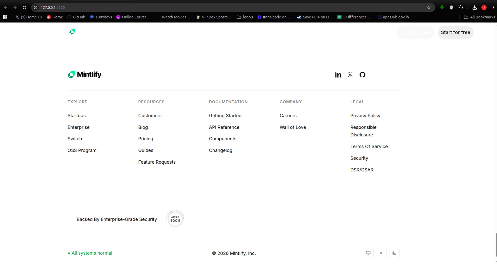

# Mintlify Clone

A modern **desktop-only clone** of the Mintlify website built using pure **HTML & CSS**.  
This project was created to practice real-world UI layouts, spacing systems, and frontend structuring.

## live Demo

https://pranabeshcodes.github.io/mintlify-clone/

## ✨ Features

✅ Clean Mintlify-inspired UI  
✅ Built with only HTML & CSS  
✅ Desktop optimized design  
✅ Organized asset structure  
✅ Modern typography & layout  

## 🛠 Tech Stack

- HTML5
- CSS3

# Preview

